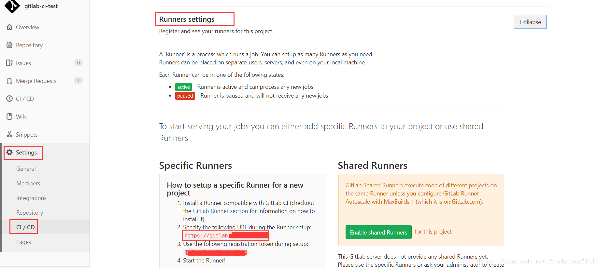
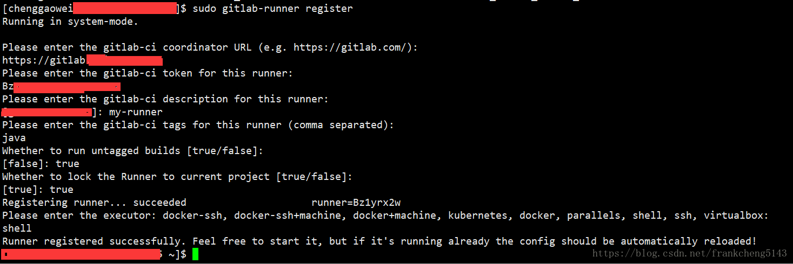
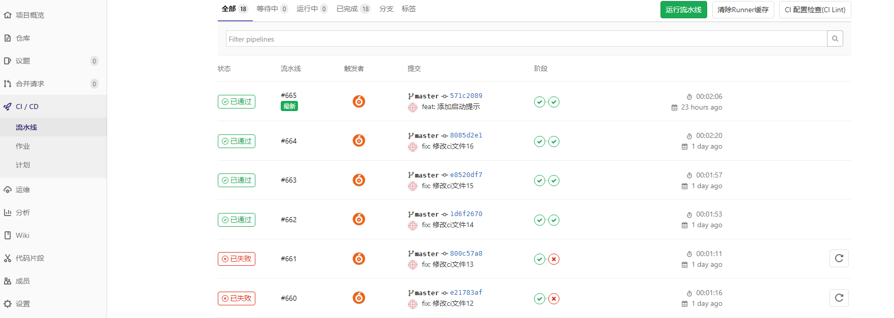
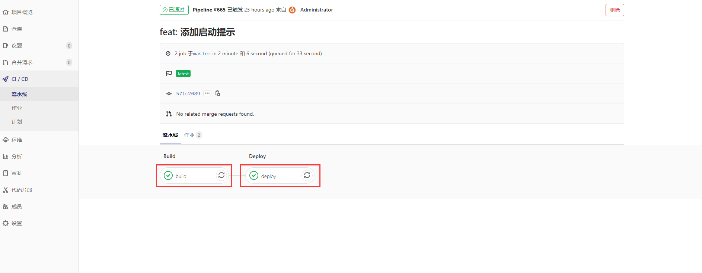
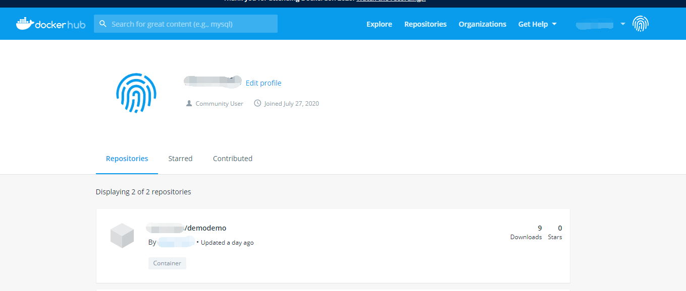

# Gitlab ci/cd集成

Gitlab 提供了对于项目持续集成的功能，通过在项目中添加 .gitlab-ci.yml 配置文件并配置，.gitlab-ci.yml文件会描述需要做什么，执行那些步骤。一般情况下分为3个阶段 `build`、`test` 和 `deploy` ，也可以不完全按照这3个阶段来执行，这个更具项目的需求来选择。

配置完成之后，需要将相应的步骤交由gitlab-runner来执行，gitlab-runner相当于是一个客户端，你需要在本地安装gitlab-runner，并且配置gitlab仓库与你的gitlab-runner相连接，一旦需要有新的命令需要执行，就会由gitlab-runner来运行。

简而言之，实现一个可运行的 CI 服务所需的步骤可归纳为：

- 将 `.gitlab-ci.yml` 文件添加到存储库的根目录下。

- 配置一个 Runner。

  

## 安装配置runner

安装：可以参考官方文档，根据自己的环境来安装，我目前是安装在linux环境中的。 [安装runner](https://links.jianshu.com/go?to=https%3A%2F%2Fdocs.gitlab.com%2Frunner%2Finstall%2F)


配置流程：

1. 在运行环境使用指令 : gitlab-runner register
2. 在github中获取自己runner需要的配置，如图:



3. 输入token，就是截图里的token

4. 输入对Runner的描述，这个在GitLab’s UI可以修改，比如my-runner

5. 给Runner打个标签，这个在GitLab’s UI可以修改，比如java

6. 是否Runner执行没有标签的构建任务，输入true

7. 是否将Runner锁定到当前项目，这个在GitLab’s UI可以修改，输入true

8. 输入Runner的执行者，这里我选择shell



配置好了之后可以在Runner看到已激活的显示，这样就配好了


## 配置.gitlab-ci.yml

在当前项目的根目录创建 .gitlab-ci.yml ,下面是我的一个demo，有一些详细的注释

```
#当前配置文件的环境变量
variables:
  MAVEN_CLI_OPTS: "-s .m2/settings.xml --batch-mode"
  MAVEN_OPTS: "-Dmaven.repo.local=.m2/repository"

#两个阶段
stages:
  - build
  - deploy

build:
# tags需要和runner指定成相同的tag
  tags:
    - demo
# 使用maven的docker镜像来运行指令
  image: maven:latest
# 声明构建阶段
  stage: build
# 文件缓存的目录
  cache:
    paths:
      - .m2/repository
      - target/
# 执行maven的打包相关指令
  script:
    - mvn $MAVEN_CLI_OPTS compile
    - mvn $MAVEN_CLI_OPTS clean
    - mvn $MAVEN_CLI_OPTS package
# 只对master分支有变化才执行
  only:
    - master

deploy:
# tags需要和runner指定成相同的tag
  tags:
    - demo
# 使用docker镜像来运行指令
  image: docker:latest
# 声明部署阶段
  stage: deploy

  cache:
    paths:
      - target/
# 声明更改不会改变文件，减少上传步骤
    policy: pull
# 提前执行的指令，登录docker仓库，带$的是环境变量，这些环境变量直接配置到了gitlab上，可以在gutlab中配置。
  before_script:
    - docker login --username $USERNAME --password $PASSWORD
# 构建doker镜像，并且上传到docker仓库中
  script:
    - docker build -t $USERNAME/demodemo:latest .
    - docker push $USERNAME/demodemo:latest
# 只对master分支有变化才执行
  only:
    - master
```

参考[官方文档](https://docs.gitlab.com/ee/ci/yaml/README.html)。


## 查看流水线和作业的状态


1. 编辑好之后，push到仓库上，然后可以在项目的流水线界面看到当前的执行情况，这路可以看到因为我测试了很多次所有，有很多记录。如果时刚刚提交的话，可以查看及时的状态。现在的话我们只能看一条我们最后的配置运行的情况。




2. 我们进入到第一条流水线，可以看到如图的两个阶段，就是配置文件里面的两个阶段，我们可以点击进入相应的阶段，查看即时的gitlab-runner运行日志。方便我们修改解决配置的问题。




3. 最后，因为我们脚本是将文件打包成镜像放到dockerhub上，最后我们登录dockerhub能够产看我们上传的镜像



## 总结

总的来说 `ci / cd` 简化了很多步骤，只需要我们将配置文件配置好，后续的构建部署测试都交由 `gitlab-runner` 来执行，这样简化了我们很多步骤，也减少了出错的可能性。