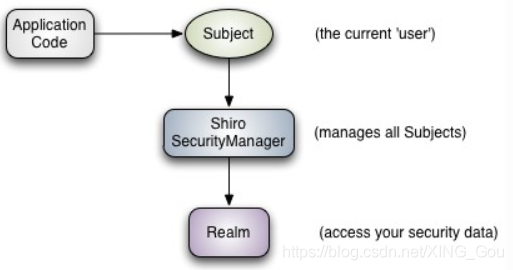
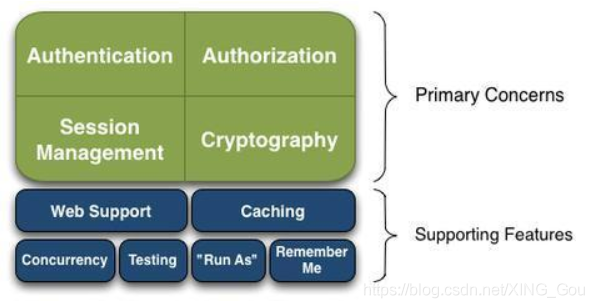

# 安全框架Shiro和Spring Security比较

## 1.Shiro

Apache Shiro是一个强大且易用的Java安全框架,能够非常清晰的处理认证、授权、管理会话以及密码加密。使用Shiro的易于理解的API,您可以快速、轻松地获得任何应用程序,从最小的移动应用程序到最大的网络和企业应用程序。对于我来说，与Spring Security相比，**Shiro更加主流、也更加简单易用**，它不但是适用于javaSE环境，也适用于javaEE环境；最重要的是谁简单易懂，且能够快速实现要求，我就用谁！！！

#### 1.2 Shiro架构组成

- **subject**：主体，可以是用户也可以是程序，主体要访问系统，系统需要对主体进行认证、授权。
- **securityManager**：安全管理器，主体进行认证和授权都是通过 securityManager 进行，是shiro的心脏。
- **realm**：域，领域，相当于数据源，通俗意义的DAO层，通过realm存取认证、授权相关数据。

#### 1.3 Shiro功能介绍

- **Authentication**
  认证，也就是登陆，我们可以利用Shiro完成登陆，登录时的密码匹配，就是Shiro帮我们完成的
- **Authorization**
  授权，当我们点一个连接或一个按钮的时候，Shiro会帮我们判断你有没有这个权限，有权先即可执行
- **SessionManagement**
  Shiro向我们提供的*Session*；
  我们在web环境下可以使用SesCryptsion，当然，这个是httpSession，如果使用Shiro的话，即便你身处非web环境下，我们也可以使用Session，那个Session，就是Shiro给我们提供的；
- **Cryptography**
  加密，到后面会有具体详解；
- **Web Support**
  可以很容易的跟，JavaEE应用进行集成；
- **Caching**
  可以在多线程的情况下进行授权，认证；
- **Testing**
  测试
- **Caching**
  Shiro提供了缓存模块，让我们的运行速度更快；
- **Run As**
  让已经登录的用户，以另外一个用户的身份，来操作当前的系统；
- **RememberMe**
  记住我，用于登录时记住用户登录信息。/

#### 1.4 Shrio特点介绍

1. 易于理解的 Java Security API；
2. 简单的身份认证（登录），支持多种数据源（LDAP，JDBC，Kerberos，ActiveDirectory 等）；
3. 对角色的简单的签权（访问控制），支持细粒度的签权；
4. 支持一级缓存，以提升应用程序的性能；
5. 内置的基于 POJO 企业会话管理，适用于 Web 以及非 Web 的环境；
6. 异构客户端会话访问；
7. 非常简单的加密 API；
8. 不跟任何的框架或者容器捆绑，可以独立运行。

## 2. Spring Security

#### 2.1 Spring Security简介

Spring Security是一个能够为基于Spring的企业应用系统提供声明式的安全访问控制解决方案的安全框架。它提供了一组可以在Spring应用上下文中配置的Bean，充分利用了Spring IoC，DI（控制反转Inversion of Control ,DI:Dependency Injection 依赖注入）和AOP（面向切面编程）功能，为应用系统提供声明式的安全访问控制功能，减少了为企业系统安全控制编写大量重复代码的工作。它是一个轻量级的安全框架，它确保基于Spring的应用程序提供身份验证和授权支持。它与Spring MVC有很好地集成，并配备了流行的安全算法实现捆绑在一起。安全主要包括两个操作“认证”与“验证”（有时候也会叫做权限控制）。“认证”是为用户建立一个其声明的角色的过程，这个角色可以一个用户、一个设备或者一个系统。“验证”指的是一个用户在你的应用中能够执行某个操作。在到达授权判断之前，角色已经在身份认证过程中建立了。

#### 2.2 对Spring Security个人看法

对于`spring Security` 很多东西都帮你封装好了，需要修改的话还需要自己重写相关方法，这一点我觉得会非常的繁琐，不是很灵活。而且对于异常处理，有些直接在过滤器链中直接处理了，不会往上一层抛出，这样对于异常信息的管理不太方便。我认为`Spring Security`就是因为`Spring`而出名，但是它比shiro在使用过程中相对比较难一些，且它所拥有的功能，大部分Shrio都可以实现。尽管**Spring Security对Oauth、OpenID也有支持,Shiro则需要自己手动实现**，但是这两个功能现用户与各个产品间单点登录已经可以通过cookies实现。

#### 2.3 架构图

#### 2.4 Spring Security一般流程为

1. 当用户登录时，前端将用户输入的用户名、密码信息传输到后台，后台用一个类对象将其封装起来，通常使用的是UsernamePasswordAuthenticationToken这个类。
2. 程序负责验证这个类对象。验证方法是调用Service根据username从数据库中取用户信息到实体类的实例中，比较两者的密码，如果密码正确就成功登陆，同时把包含着用户的用户名、密码、所具有的权限等信息的类对象放到SecurityContextHolder（安全上下文容器，类似Session）中去。
3. 用户访问一个资源的时候，首先判断是否是受限资源。如果是的话还要判断当前是否未登录，没有的话就跳到登录页面。
4. 如果用户已经登录，访问一个受限资源的时候，程序要根据url去数据库中取出该资源所对应的所有可以访问的角色，然后拿着当前用户的所有角色一一对比，判断用户是否可以访问。

#### 2.5 Shiro和Spring Security比较

Shiro比Spring更容易使用，实现和最重要的理解

Spring Security更加知名的唯一原因是因为品牌名称

“Spring”以简单而闻名，但讽刺的是很多人发现安装Spring Security很难

然而，Spring Security却有更好的社区支持

Apache Shiro在Spring Security处理密码学方面有一个额外的模块

Spring-security 对spring 结合较好，如果项目用的springmvc ，使用起来很方便。但是如果项目中没有用到spring，那就不要考虑它了。

Shiro 功能强大、且 简单、灵活。是Apache 下的项目比较可靠，且不跟任何的框架或者容器绑定，可以独立运行